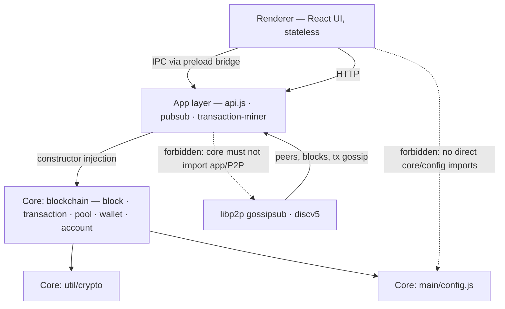

# Architecture Spine — SuccinctCoin

## Design Paradigm

**Layered architecture with a decoupled headless core.** Three layers, strict downward dependencies:

- **Core** (`src/main/blockchain`, `src/main/util`, `src/main/config.js`) — pure domain: blocks, transactions, pool, wallet, accounts, crypto. No Electron, no HTTP, no P2P, no logging. I/O limited to the application's on-disk stores under the configured root (blocks, accounts, wallet); validation must never treat local disk state as a consensus input (AD-10).
- **App** (`src/main/api.js`, `src/main/app`, `src/config.js`) — composition root and transport: HTTP API, libp2p gossipsub/discv5, autonomous miner loop, root bootstrap.
- **Renderer** (`src/renderer`) — stateless React UI; talks to the app layer only through the preload bridge (IPC) and HTTP.

The core is a library the app drives, never the reverse. This is the load-bearing shape: it is what lets every peer run, verify, and extend identical consensus logic.

## Invariants & Rules

### AD-1 — Headless core [ADOPTED]

- **Binds:** `blockchain-core`, `crypto-utils`, `wallet`, `account-management`, `transaction-system`
- **Prevents:** the core drifting into Electron/HTTP/P2P coupling, making it untestable in isolation and unusable in non-desktop peers.
- **Rule:** the core never imports Electron, express, libp2p, or the renderer, and performs no logging, IPC, or HTTP. All consensus-relevant logic (chain validity, transaction validation, hashing, signing, miner selection) lives in the core or a pure core-adjacent module.

### AD-2 — Symmetric network, longer-valid-chain wins [ADOPTED]

- **Binds:** `p2p-networking`, `blockchain-core`, `api-endpoints`
- **Prevents:** reintroducing a root-authority or any standing privileged node; divergence in chain-choice rules between nodes.
- **Rule:** all nodes are equal. Chain state changes only through the existing `Blockchain.replaceChain` rule: the candidate chain must be fully valid and strictly longer, otherwise it is rejected. No node's state is canonical over another's.

### AD-3 — Equal mining eligibility; no purchasable privilege [ADOPTED]

- **Binds:** `transaction-miner`, `transaction-system`, `configuration`, `wallet`, `account-management`
- **Prevents:** stake-weighted, hardware-weighted, or any other privilege-based mining re-entering the design.
- **Rule:** any running node may mine; the block reward goes to the miner of the accepted block. Hardware speed and staked balance are not inputs to eligibility. Stake remains a neutral capital lock (≤ 10% of balance) that gates nothing.

### AD-4 — Per-block lottery miner selection [ADOPTED, TARGET-STATE — not yet implemented; see Deferred]

- **Binds:** `transaction-miner`, `blockchain-core`, `p2p-networking`
- **Prevents:** the first-come race (current HTTP-triggered mining is a hardware/network race) and any coordinator or shared state for selection.
- **Rule:** the miner of block *h+1* is a deterministic pure function of (block *h* hash, candidate node public key), computable identically by every peer without coordination. **Peer-invariance:** the function may depend only on block *h* data and the candidate public key — never on a node's peer set or local state (this excludes argmin-over-known-peers; see AD-11). Mining is autonomous: each node evaluates the lottery against its current head on an interval (app-semantic liveness value per AD-8, defaulting to 1000 ms). The HTTP mine endpoint is a dev convenience, not the mining path. The selection function lives in the core per AD-1.

### AD-5 — Root node is bootstrap-only [ADOPTED]

- **Binds:** `p2p-networking`, `api-endpoints`, `configuration`, `blockchain-core`
- **Prevents:** treating root state as canonical over peer state (the spec's "Chain-sync precedence" requirement is read through this AD; rewriting that requirement to empty-chain-only scope is recorded in Deferred).
- **Rule:** the configured root (`ROOT_NODE_ADDRESS`) is consulted only to seed an **empty** local chain and **empty** local pool at startup (`api.syncWithRootState`). Both halves are emptiness-gated: the chain half by AD-2 (strictly-longer valid), the pool half by AD-13 (additive merge, never a full replace). The root has no standing authority: a longer valid chain from any peer still wins per AD-2. Demoting or removing the root is a later improvement, not a current design goal.

### AD-6 — Discovery bootstrap is bootstrap-only [ADOPTED]

- **Binds:** `p2p-networking`, `configuration`
- **Prevents:** discovery seeds being treated as trusted state sources, or a "bootstrap operator" becoming a de-facto privileged node.
- **Rule:** a small set of well-known discv5 bootstrap ENRs (plus optional relay endpoints) ships in app-level config to seed peer discovery for zero-peer nodes. They seed **discovery only**, never chain state; running a bootstrap node confers no mining or state authority.

### AD-7 — Single composition root [ADOPTED]

- **Binds:** `api-endpoints`, `electron-app`, all app units
- **Prevents:** scattered singleton construction and hidden coupling between app units.
- **Rule:** `src/main/api.js` is the only module that instantiates the shared singletons (blockchain, transaction pool, wallet, pubsub, miner). Every other unit receives its dependencies via constructor injection; shared state is mutated only through the owning unit's own methods.

### AD-8 — One owner per config value [ADOPTED]

- **Binds:** `configuration`, `renderer-ui`, `p2p-networking`, `blockchain-core`
- **Prevents:** the current dual-owner state (`src/config.js` and `src/main/config.js` both in use; renderer importing app config directly).
- **Rule:** chain-semantic values (genesis, reward, stake rules, validation rate, store paths) belong to the core config (`src/main/config.js`); network/app values (ports, channels, bootstrap ENRs, relay endpoints, the mining re-check interval) belong to app config (`src/config.js`). The mining re-check interval is **app-semantic** (liveness, not consensus) and is a **distinct** value from core `VALIDATION_RATE` — sharing the same default number is coincidence, not an alias. The renderer imports no config file directly [TARGET-STATE — three renderer components currently import `src/config.js`] — it receives UI values (API port) via the preload bridge.

### AD-9 — Core throws, app maps [ADOPTED, TARGET-STATE — core currently logs (4 leak sites in `blockchain/index.js`, plus `console.error` in `transaction-pool.js`) and the error→status table is not yet canonical]

- **Binds:** `blockchain-core`, `api-endpoints`, `renderer-ui`
- **Prevents:** core leaking I/O side effects (breaking AD-1) and inconsistent error surfaces between HTTP and IPC.
- **Rule:** core units report failure by throwing. The app layer catches and maps to HTTP status codes or IPC responses, and owns all logging and user-facing messages. Canonical mapping and envelope: the Consistency Conventions "Error envelope" row.

### AD-10 — Deterministic state-transition function [ADOPTED, TARGET-STATE — not yet implemented; current validator reads local on-disk account state]

- **Binds:** `blockchain-core`, `transaction-system`, `account-management`, `wallet`
- **Prevents:** consensus validity being node-relative — two honest nodes disagreeing on whether the same chain is valid because each validates against its own on-disk account files (current `tx.validate()` reads the sender's local balance, which no production path ever updates, so user transactions fail on every node and rewards/stakes are never applied).
- **Rule:** exactly one deterministic state-transition function lives in the core: applying an accepted block's transactions to account state that is **derived from the chain alone** (replay over the accepted chain). Validation MUST be a pure function of chain contents and MUST NOT read local mutable on-disk account state as an input. Balances and stakes are computed from the chain, never stored as a consensus input.

### AD-11 — Lottery: fixed-odds threshold, canonical inputs [ADOPTED, TARGET-STATE]

- **Binds:** `transaction-miner`, `blockchain-core`, `p2p-networking`, `configuration`
- **Prevents:** the two deferred lottery variants (fixed-odds threshold vs argmin over known peers) being non-interchangeable — argmin is peer-set-dependent, so different nodes would select different miners for the same block — and encoding drift (hex-string vs raw-byte inputs hash differently).
- **Rule:** the lottery family is **fixed-odds threshold**: a node wins block *h+1* iff `Crypto.hash(prevBlockHash, nodePublicKey) < threshold`, self-evaluated. Both inputs are **hex strings** (`prevBlockHash` = block *h*'s hex hash; `nodePublicKey` = the wallet's hex public key); argument order is immaterial (`Crypto.hash` sorts its inputs). The function is peer-invariant by construction (AD-4). Simultaneous winners produce same-height forks resolved by AD-14 + AD-2. Only the threshold probability *p* remains a free parameter — a single tunable owned by core config.

### AD-12 — Canonical block contents [ADOPTED, ratifies and extends current code]

- **Binds:** `blockchain-core`, `transaction-system`, `crypto-utils`
- **Prevents:** two builds hashing different field sets, or ordering intra-block transactions differently — both are block-hash inputs, so any divergence makes the builds' chains mutually invalid from the first block (the current timestamp-sort comparator is also inconsistent on equal timestamps).
- **Rule:** the block hash is `Crypto.hash(height, uuid, timestamp, miner, lastHash, data)` — exactly these fields; adding or removing a field is a consensus-breaking change (hard fork). `data` is the block's transaction multiset in the deterministic total order **(timestamp ASC, uuid ASC)**; this order is part of the block hash. The same enumeration applies to the transaction signature inputs (the field array in `wallet.transactionSignature`), which is pinned identically.

### AD-13 — Pool sync is empty-gated and additive [ADOPTED, TARGET-STATE — current `syncWithRootState` does an ungated `setMap` full replace]

- **Binds:** `p2p-networking`, `api-endpoints`, `transaction-system`
- **Prevents:** a remote source (root or peer) overwriting the local transaction pool — the pool determines the next block's contents, so an ungated full replace is a standing-authority leak (the chain half is already defended by AD-2; the pool half is not).
- **Rule:** pool ingestion from any remote is a **union merge by transaction uuid**; a full `setMap` from a remote is prohibited. The root may populate the local pool only while the local pool is **empty** (bootstrap). A non-empty local pool is never overwritten by root or peer.

### AD-14 — Equal-length fork resolution [ADOPTED]

- **Binds:** `blockchain-core`, `p2p-networking`
- **Prevents:** a node holding two valid equal-length chains picking its build-on tip non-deterministically (first-received vs arbitrary) — the tip is the next lottery's `prevHash` input (AD-11), so a free tip choice feeds directly into divergent miner selection.
- **Rule:** when a node holds two valid chains of equal length, it builds on the one with the **lower block hash at the divergence point** (deterministic, identical on all nodes). Equal-length *incoming* chains are still rejected (no replace); forks converge by strictly-longer extension per AD-2.

## Dependency Direction



The dashed "forbidden" edges are the AD-1/AD-8 target state, not the current import graph.

## Consistency Conventions

| Concern | Convention |
| --- | --- |
| Money | `big.js`, integer units, never JavaScript floats. Fee computed in the app layer as `Big(amount).div(1000)`; the core validates. |
| Hashing & signing | `Crypto.hash` = sha512 over sorted JSON inputs, hex-encoded; ECDSA via `@noble/secp256k1` (webpack-externalized, mocked in tests). The sort applies to top-level inputs; the block-hash field set is pinned by AD-12, the tx-signature field set identically. (Known gap: no *recursive* key sort for object inputs — Deferred, crypto-utils spec.) |
| Transaction lifecycle | Created only via `Wallet.createTransaction`; signed before entering the pool; immutable afterward. |
| Special addresses | Literal sentinel strings (`*authorized-reward*`, `*authorized-stake*`, `*authorized-credit*`) defined only in core config. |
| Stake | Neutral lock: ≤ 10% of sender balance, `MINIMUM_STAKE_AMOUNT` = 200; gates nothing (AD-3). |
| Errors & logging | Core throws; app layer maps and logs (AD-9). No `console`/`stderr` in core. |
| Persistence | On-disk store under `~/.succinctcoin/` (wallet, accounts, blocks); test runs under `.test/` via `JEST_WORKER_ID`. |
| Complexity | Max cyclomatic complexity 8; refactor via helpers, early returns, decomposed conditionals. |
| State transition | Exactly one deterministic core function applies an accepted block to chain-derived account state; validation never reads local disk state (AD-10). |
| Canonical block contents | Hash field set `(height, uuid, timestamp, miner, lastHash, data)`; `data` sorted `(timestamp ASC, uuid ASC)`; field-set or order changes are hard forks (AD-12). |
| Lottery input form | `prevBlockHash` and `nodePublicKey` are both hex strings into `Crypto.hash`; argument order immaterial (AD-11). |
| Pool sync | Remote pool ingestion is an additive merge by uuid; full replace prohibited; root populates only an empty pool (AD-13). |
| Mining re-check interval | App-semantic liveness value in app config; distinct from core `VALIDATION_RATE` (AD-8). |
| Error envelope | `{ type: 'error', code: <stable string>, message }` over both HTTP and IPC; status map: duplicate→409, insufficient balance→402, invalid hash/signature→400, unexpected→500 (AD-9). |
| Preload bridge | Exposes `window.electronAPI.getApiPort(): number` (synchronous pull); the sole renderer→app config surface (AD-8, target state). |
| Key custody | Wallet private key is plaintext hex under `~/.succinctcoin/wallet` (ratified brownfield); encrypted backup/restore and corruption detection are a target-state follow-up (wallet spec) — Deferred. |

## Stack

| Name | Version |
| --- | --- |
| Node.js (runtime) | 24.14.0 |
| Electron | 42.3.0 |
| @electron-forge/cli + plugin-webpack | 7.11.2 |
| React / react-dom | 19.0.0 |
| react-bootstrap | 2.10.9 |
| react-router-dom | 7.16.0 |
| Express | 5.2.1 |
| libp2p | 3.3.2 |
| @libp2p/gossipsub | 15.0.15 |
| @chainsafe/discv5 | 12.0.1 |
| @libp2p/circuit-relay-v2 | 4.2.5 |
| @noble/secp256k1 (transitive; externalized, jest-mocked) | 3.1.0 |
| big.js | 7.0.1 |
| dayjs | 1.11.13 |
| Jest | 30.4.2 |

## Structural Seed

```text
src/
  config.js                 # app config: ports, channels, discv5 ENRs, relays (AD-8)
  main/
    index.js                # Electron bootstrap: window, api.init(), listen, root sync
    api.js                  # THE composition root + HTTP API + IPC (AD-7)
    config.js               # core config: genesis, rewards, stake rules, store paths (AD-8)
    blockchain/             # headless core: block, transaction, transaction-pool, wallet, account
    app/                    # pubsub (libp2p), transaction-miner
    util/crypto.js          # hashing, signing, key checks (core-adjacent, pure)
  renderer/
    preload.js              # the only bridge renderer→app (AD-8)
    index.js · App.js · components/   # stateless UI (AD-1)
```

**Operational envelope.** Every node is a desktop Electron app (macOS dmg, Windows nsis, Linux deb) running the full protocol locally: on-disk store at `~/.succinctcoin/`, HTTP API on a local port, libp2p TCP over gossipsub, discv5 UDP discovery seeded from the shipped ENR list. There is no server tier and no cloud dependency; no node is required for consensus beyond the shared genesis.

- **Key custody:** the wallet private key is plaintext hex under `~/.succinctcoin/wallet` (ratified brownfield; a real secret, never committed). Encrypted seed backup/restore and corruption detection are a target-state follow-up per the wallet spec — Deferred.
- **NAT traversal:** circuit relay + DCUtR direct upgrade + UPnP port mapping, fail-soft (per p2p-networking spec; all three implemented in `pubsub.js`).
- **Environments:** dev mode is detected via `electron-is-dev` and drives the channel prefix, ports, and `ROOT_NODE_ADDRESS`. Store isolation to `.test/` applies to test runs only (`JEST_WORKER_ID`); the electron-app spec's "dev mode uses `.test/`" clause needs a conforming spec fix (Deferred).

## Capability → Architecture Map

| Capability | Lives in | Governed by |
| --- | --- | --- |
| blockchain-core | `src/main/blockchain/` | AD-1, AD-2, AD-10, AD-12, AD-14 |
| crypto-utils | `src/main/util/crypto.js` | AD-1, AD-12, AD-9 |
| transaction-system | `src/main/blockchain/{transaction,transaction-pool}.js` | AD-1, AD-10, AD-12, AD-13, conventions (lifecycle, fee) |
| transaction-miner | `src/main/app/transaction-miner.js` | AD-3, AD-4, AD-11 |
| p2p-networking | `src/main/app/pubsub.js` | AD-2, AD-5, AD-6, AD-13 |
| api-endpoints | `src/main/api.js` | AD-7, AD-8, AD-9, AD-13 |
| wallet | `src/main/blockchain/wallet.js` | AD-1, AD-7, AD-10 |
| account-management | `src/main/blockchain/account.js` | AD-1, AD-3, AD-10 |
| configuration | `src/config.js` + `src/main/config.js` | AD-8 |
| electron-app | `src/main/index.js`, `src/renderer/preload.js` | AD-7, AD-9, AD-8 (bridge shape) |
| renderer-ui | `src/renderer/` | AD-1, AD-8 |
| build-tooling | `webpack.*.config.js`, `package.json` | AD-1 (core bundling constraint), AD-8 |

## Deferred

| Item | Why it can wait |
| --- | --- |
| Sybil / multi-wallet resistance mechanism | Separate future request (user decision). The boundary is already locked by AD-3: no privilege is purchasable, which rules out bond/slashing designs that favor large stake. |
| Lottery threshold probability *p* (AD-11) | The family (fixed-odds, self-evaluated, peer-invariant), the input canonical form (hex strings), and the fork rule are fixed by AD-11/AD-14; only the single tunable *p* is open, owned by core config, set in the implementing OpenSpec change. |
| DISCV5 bootstrap ENR list + relay endpoint contents (and who hosts bootstrap nodes) | AD-6 fixes the role; the actual list and hosting are operational data, currently empty TODOs. |
| Root-sync precedence: spec rewrite + code enforcement | The rule is settled (AD-5: empty-chain-only, no standing authority); the p2p-networking "Chain-sync precedence" requirement still mandates root-first on any incoming chain while empty and must be rewritten to empty-chain-only scope, and `syncWithRootState` (fire-and-forget, no empty guard) must be made to match — one follow-up change. |
| State-transition function (AD-10) — **launch prerequisite** | Design is settled (chain-derived account state; validation pure over chain contents); implementation is a follow-up change that MUST land before any network launch — the current validator reads local on-disk balances that no production path ever writes, so every user transaction is invalid on every node today (chain cannot pass height 3). |
| Root pool full-replace (`setMap` in `syncWithRootState`) | Known AD-13 violation; fix in the same root-sync follow-up as above. |
| Autonomous-mining model in specs (AD-4) | transaction-miner ("mining happens when `mineTransactions()` is called") and api-endpoints ("Mine transactions") specs describe HTTP-triggered mining as the mining path — rewrite to the autonomous-lottery model in the change that implements AD-4/AD-11; demote `/api/mine-transactions` to dev convenience in the same change. |
| Recursive key sort in `Crypto.hash` | crypto-utils spec requires recursive key sorting of object inputs for cross-peer hash determinism; the code does a plain `JSON.stringify`. Implement (or record a spec fix) before multi-node operation. |
| Key custody: encrypted backup, restore, corruption detection | wallet spec target state; the spine ratifies plaintext hex on disk for now (see envelope). Separate follow-up. |
| electron-app spec dev-storage clause | Spec says dev mode uses `.test/` storage; code isolates only under `JEST_WORKER_ID`. Conforming spec fix in a later change. |
| Mechanical config split + renderer preload-bridge port | AD-8 records the rule; moving values and rewiring imports is a later OpenSpec change. |
